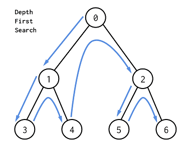
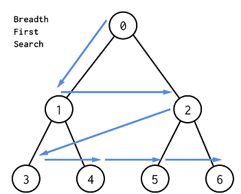

# 1. 꼭 필요한 자료구조 기초

## 🔍탐색(Search)
- 많은 양의 데이터 중에서 원하는 데이터를 찾는 과정
- 대표적 알고리즘 : DFS(깊이 우선 탐색), BFS(너비 우선 탐색)
  → 제대로 이해하려면 스택과 큐에 대한 이해가 필요하므로, 스택과 큐, 재귀 함수 정리!

## 🔍 자료구조(Data Structure)
- 데이터를 표현하고 관리하고 처리하기 위한 구조
    - 삽입(Push) : 데이터를 삽입한다
    - 삭제(Pop) : 데이터를 삭제한다
    - 오버플로(Overflow) : 데이터의 크기가 이미 가득 찬 상태에서 삽입 연산을 수행할 때 발생
    - 언더플로(Underflow) : 데이터가 전혀 들어있지 않은 상태에서 삭제 연산을 수행할 때 발생

### 📚 스택(Stack)
    import java.util.Stack;
    class StackEx {
        public static void main(String[] args) {
            // Integer형 스택 선언
            Stack<Integer> stackInt = new Stack<>();
            // String형 스택 선언
            Stack<String> stackStr = new Stack<>();
            // Boolean형 스택 선언
            Stack<Boolean> stackBool = new Stack<>();
        }
    }
- FILO 혹은 LIFO 구조 (like 박스 쌓기)
- 메서드
    1. .push(값) : 값 추가하고 해당 값 반환
    2. .pop(값) : 값 제거하고 해당 값 반환
    3. .add(값) : 값 추가
    4. .clear() : 값 모두 제거
    5. .peek() : 마지막 요소 반환, 제거는 안함
    6. .empty() : 비어있는지 여부 반환 boolean
    7. .search(값) : 값의 위치를 인덱스로 반환

### 📚 큐(Queue)
    import java.util.Queue;
    import java.util.LinkedList;
    
    Queue<자료형> 변수명 = new LinkedList<>(); // 해당 자료형만 삽입, 삭제 가능
    Queue 변수명 = new LinkedList(); // 어떤 자료형이든 삭제, 삽입 가능
- FIFO 구조 (like 대기줄)
- 메서드
    1. .add(값), .offer(값) : 삽입
    2. .remove(), .poll() : 삭제
    3. .element(), .peek() : 큐 head에 위치한 value 반환
    4. .clear() : 초기화
    5. .size() : 크기
    6. .contains() : 해당 원소 존재하는지 true false 반환
    7. .isEmpty() : 공백 큐인지 true | false 반환

### 📚 재귀함수 (Recursive Function)
- 자기자신을 다시 호출하는 함수
- 재귀 함수가 언제 끝날지, 종료 조건을 명시해야 한다

# 2. 탐색 알고리즘 DFS/BFS
### 📚 전역 클래스 Node
    class Node {
        int data;
        Node lt, rt;
        public Node(int val) {
            data = val;
            lt = null;
            rt = null;
        }
    }

### 📚 DFS(Depth First Search, 깊이 우선 탐색)

    public class DFS{
        Node root;
        public static void main(String[] args) {
            DFS tree = new DFS();
            tree.root = new Node(0);
            tree.root.lt = new Node(1);
            tree.root.rt = new Node(2);
            tree.root.lt.lt = new Node(3);
            tree.root.lt.rt = new Node(4);
            tree.root.rt.lt = new Node(5);
            tree.root.rt.rt = new Node(6);
            tree.DFS(tree.root);
        }
    }
    public void DFS(Node root) {
        if(root == null) return;
        else {
            System.out.println(root.data + " ");
            DFS(root.lt);
            DFS(root.rt);
        }
    }
    // 0 1 3 4 2 5 6
- 순환 알고리즘 형태, 백 트래킹 이용
- 스택을 사용하고, 모든 노드를 방문하고자 할 때 사용
- BFS보다 간단하지만, 검색 속도 자체는 보다 느림

### 📚 BFS(Breath First Search, 너비 우선 탐색)

    public class BFS{
        Node root;
        public static void main(String[] args){
            BFS tree = new BFS();
            tree.root = new Node(0);
            tree.root.lt = new Node(1);
            tree.root.rt = new Node(2);
            tree.root.lt.lt = new Node(3);
            tree.root.lt.rt = new Node(4);
            tree.root.rt.lt = new Node(5);
            tree.root.rt.rt = new Node(6);
            tree.BFS(tree.root);
        }
    }
    public void BFS(Node root) {
        Queue<Node> Q = new LinkedList<>();
        Q.offer(root);
        int L = 0;
        while (!Q.isEmpty()) {
           int len = Q.size();
            System.out.println(L + " : ");
            for(int i=0; i<len; i++) {
                Node current = Q.poll();
                System.out.print(current.data + " ");
                if(current.lt != null) {
                    Q.offer(current.lt);
                }
                if(current.rt != null) {
                    Q.offer(current.rt);
                }
            }
            L++;
            System.out.println();
        }
    }
    /* 
    0 : 0
    1 : 1 2
    2 : 3 4 5 6
    */